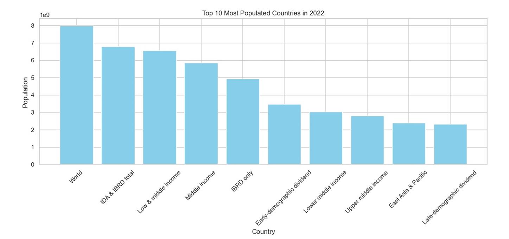
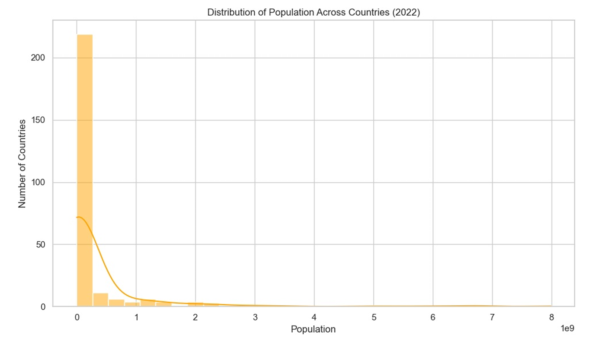

# 🌍 Population Analysis – World Bank Dataset

This project explores global population trends using World Bank data from 1960 to 2022. It focuses on identifying top populated countries and understanding overall distribution.

## 🔍 Key Features
- Cleaned dataset and removed unnecessary columns
- Visualized **Top 10 Most Populated Countries in 2022**
- Plotted **Population Distribution Histogram** across countries

## 📊 Visuals
### Top 10 Most Populated Countries (2022)

### Population Distribution Histogram

## 🧰 Tools Used
- Python
- Pandas
- Matplotlib
- Seaborn

## 📁 Project Files
- `Population_Analysis.ipynb` – Analysis and visualizations
- `population.csv` – Cleaned dataset
- `.png` – Chart images

## 📌 Summary
This task was completed as part of **Task 01** during my **Data Science Internship at Prodigy InfoTech**. It helped me strengthen skills in:
- Exploratory Data Analysis (EDA)
- Real-world dataset handling
- Data visualization & storytelling

## 👩‍💻 Author
**Harshitha Adicherla**

📬 Feedback and contributions are welcome!
